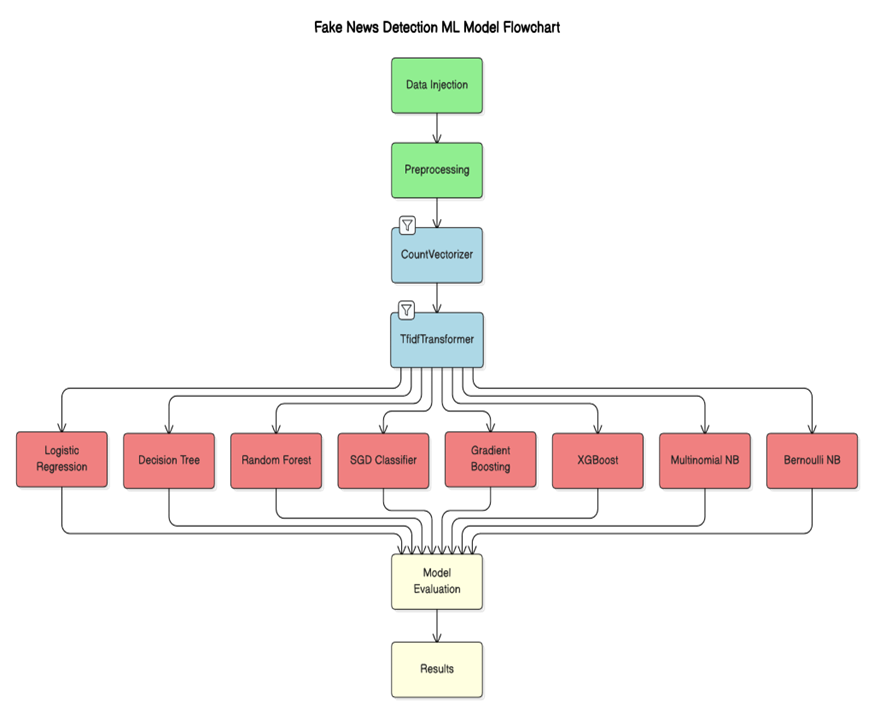
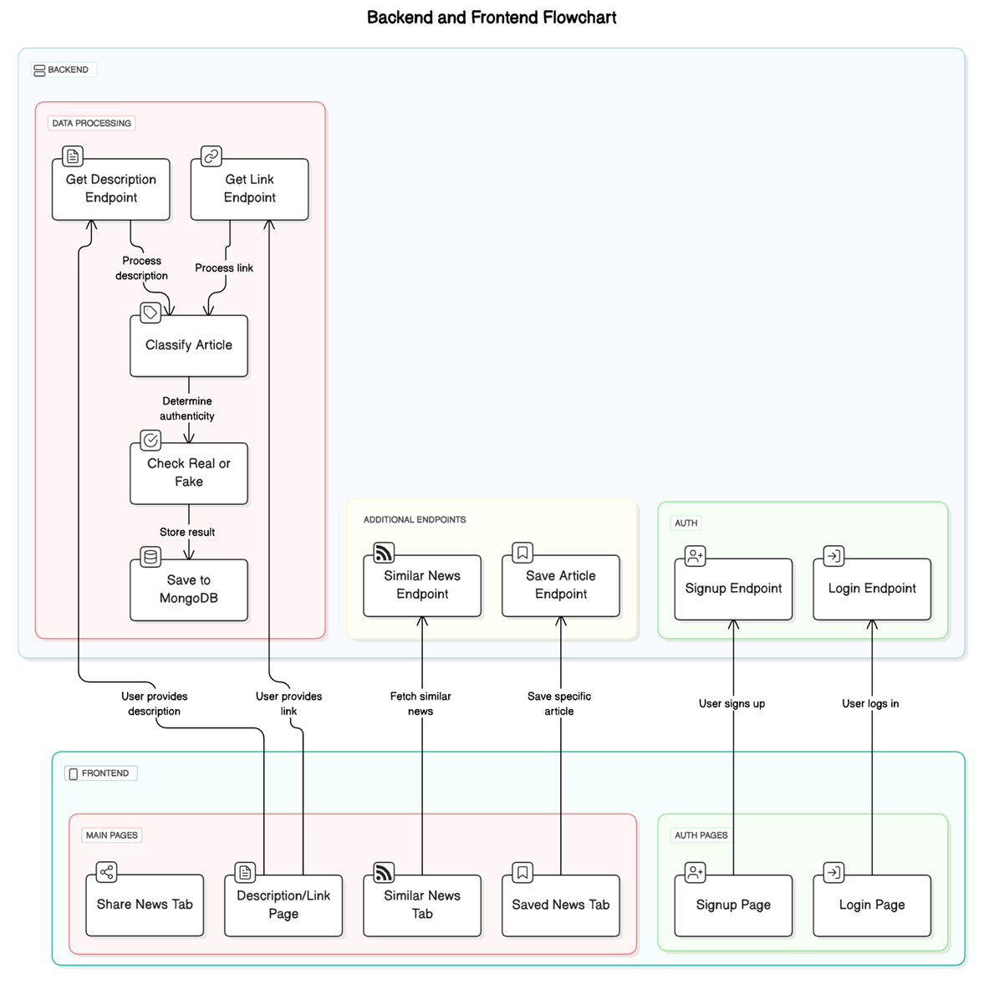

# News Navigator

## Overview
News Navigator is a React Native application designed to help users verify the authenticity of news articles and categorize them into relevant topics. Users can input either the URL or the description of a news article, and the app will classify it as real or fake. Additionally, users can bookmark or share articles for future reference.

The project leverages machine learning models trained on a dataset to perform fake news detection and news categorization.

---

## Features
- **News Classification**: Determine whether a news article is real or fake.
- **Categorization**: Classify news articles into specific categories based on content.
- **User Inputs**: Provide a link to the news article or input its description.
- **Bookmarking**: Save articles for future reading.
- **Sharing**: Share news articles with others directly from the app.

---

## Technology Stack
### Frontend
- **React Native**: Used for building the cross-platform mobile application.

### Backend
- **Machine Learning Models**: 
- Built using Python-based libraries and frameworks.
- Flask-based backend for machine learning model predictions.
- Node.js backend for authentication and MongoDB integration for storing user
data and news articles

### Machine Learning Models
Eight machine learning models were trained for this project, focusing on fake news detection and categorization:
1. Logistic Regression (Achieved the highest accuracy)
2. Decision Tree
3. Random Forest
4. Stochastic Gradient Descent (SGD)
5. Gradient Boosting
6. XGBoost
7. Naive Bayes
8. Support Vector Machine (SVM)

---
## Architectural Diagram



## Dataset and Research
The project relied on a labeled dataset for fake news detection and categorization. The dataset underwent preprocessing steps such as text cleaning, vectorization, and feature extraction.


**Key Insights from Research:**
- Logistic Regression outperformed other models, achieving the highest accuracy.
- Models like Gradient Boosting and XGBoost provided competitive results for specific cases.
- A combination of text vectorization techniques (e.g., TF-IDF) and robust feature engineering enhanced classification performance.

---

## Installation and Setup
### Prerequisites
- Node.js
- React Native CLI 
- Python environment with necessary ML libraries (for backend integration)

### Steps
1. Clone the repository:
   ```bash
   git clone https://github.com/Geekyash10/NewsNavigator
   ```
2. Navigate to the project directory:
   ```bash
   cd NewsNavigator
   ```
3. Install dependencies:
   ```bash
   npm install
   ```
4. Start the development server:
   ```bash
   npx react-native run-android
   ```

For backend setup, ensure the machine learning API is hosted and accessible by the app.

---
## Application Screenshots
<div style="display: flex; flex-wrap: wrap; gap: 10px;">
  
  
  
  
  
  
</d4v>

## Usage
1. Choose to input a news article by pasting its URL or entering its description.
3. View the classification results (Real or Fake) and the assigned category.
4. Bookmark the article for future access or share it with others.

---

## Future Enhancements
- Integration with more advanced deep learning models like transformers (e.g., BERT, RoBERTa).
- Support for multiple languages.
- Real-time news updates and push notifications.
- Enhanced user interface and experience.

---

## Contributors
- [Yash Mittal](https://github.com/Geekyash10)
- [Yash Agarwal](https://github.com/yashagarwal0812)
- [Isha Singhal](https://github.com/29isha)

---
